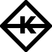

# `3Karma ⚡`



Decentralised Domain Credit Rating


### MOTIVATION
Website Review/Rating are done by Internet User on Web2 World, it would be open a new possibilities if we can make Website Review/Rating are done By another Website. 
Built during the [L2 Rollathon](https://gitcoin.co/hackathon/Rollathon/)


### LIVE APP
https://3karma.netlify.app

### APPLICATION DEMO

[VIDEO DEMO](https://drive.google.com/open?id=1iJzFy3KqWDkAgFXH16wTGZ8xM-ZbVGs8&authuser=raqrobby%40gmail.com&usp=drive_fs)


#### CONTACT
Person of contact in case there are any questions
Discord ID 
##### 0xMatoa

### DEPLOY  🚀

[](https://open.vscode.dev/byre54/3karma)

npm:
```sh
npm i
npm run build
npm run serve
```

yarn:
```sh
yarn
yarn build
yarn serve
```

[](https://app.netlify.com/start/deploy?repository=https://github.com/byre54/3karma)


### TECHNOLOGY USED


# ⁂
### web3.storage


#### BUY ME A COFFEE
0x7342c7d7B8D0aE7FeCe192a15F5Ba5243dcCA45F
